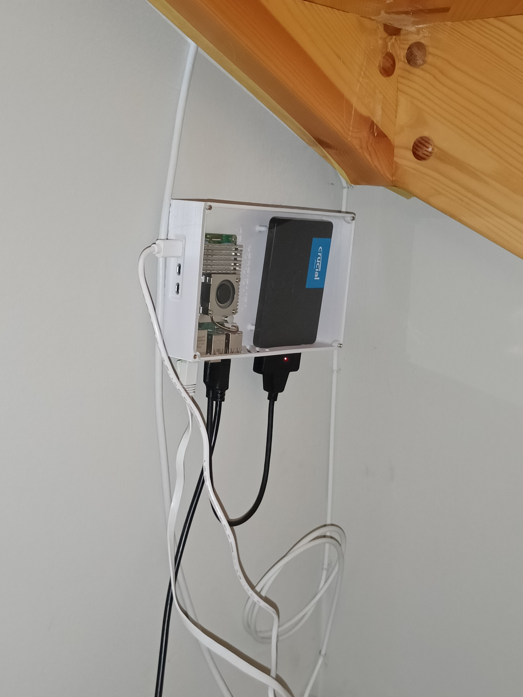

# Home Assistant Smart Home Server

This repository contains my Home Assistant setup running on a Raspberry Pi 5 with detailed documentation, configuration examples, and hardware design files.

## 📸 Hardware Setup

### Production Setup

*Raspberry Pi 5 with SSD and Zigbee dongle mounted on wall*

### 3D Case Design

*Custom 3D-printed case for Raspberry Pi 5 + 2.5" SATA SSD*

## 🔧 Hardware Specifications

- **Main Board**: Raspberry Pi 5 Model B
- **RAM**: 8 GB
- **Storage**: 256 GB SATA SSD (2.5")
- **Storage Adapter**: USB to SATA adapter
- **Zigbee Coordinator**: Sonoff Zigbee 3.0 USB Dongle Plus
- **USB Extension**: For optimal Zigbee signal (reduces interference from Pi)
- **Enclosure**: Custom 3D-printed case (design included in `pictures/`)

## 📁 Repository Structure

```
.
├── README.md                 # This file
├── pictures/                 # Hardware photos and case designs
├── config/                   # Home Assistant configuration files
│   ├── configuration.yaml    # Main HA configuration
│   ├── automations.yaml      # Automation rules
│   ├── scripts.yaml          # Custom scripts
│   └── scenes.yaml           # Scene definitions
├── integrations/             # Integration-specific configs
│   └── zigbee2mqtt/          # Zigbee device configurations
├── dashboards/               # Lovelace dashboard configs
└── docs/                     # Additional documentation
```

## 🚀 Getting Started

See the [Getting Started Guide](docs/getting-started.md) for detailed setup instructions.

## 📚 Documentation

- [Hardware Setup Guide](docs/hardware-setup.md)
- [Configuration Guide](docs/configuration.md)
- [Automation Examples](docs/automation-examples.md)
- [Zigbee Device Integration](docs/zigbee-devices.md)
- [Troubleshooting](docs/troubleshooting.md)

## 🤝 Contributing

Feel free to use this repository as inspiration for your own Home Assistant setup. Configuration examples are provided as templates that you can adapt to your needs.

## 📝 License

This is a personal Home Assistant configuration repository. Feel free to use any examples or configurations for your own setup.